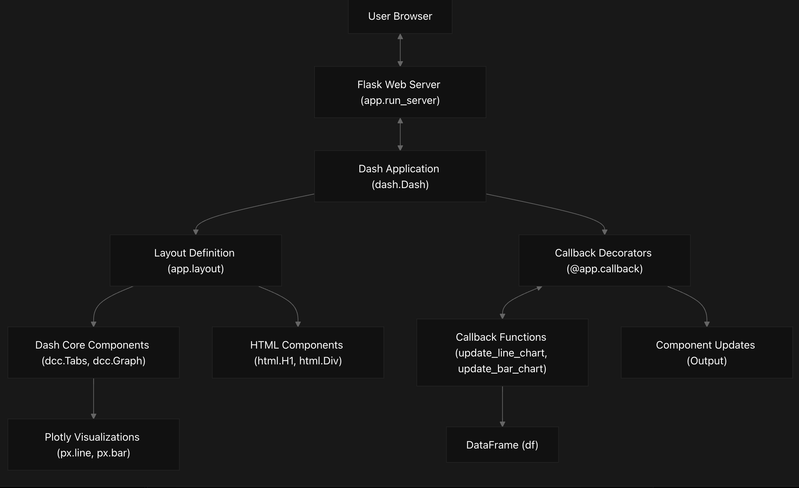

# PlotlyDash Overview
## Purpose and Scope
This document provides a comprehensive introduction to the PlotlyDash repository, which serves as boilerplate code for creating interactive data visualization dashboards using Plotly Dash. It covers the high-level architecture of the framework, key features, and the template structure.
## What is PlotlyDash?
PlotlyDash is a boilerplate repository for building web-based dashboards using Plotly Dash, a Python framework for creating interactive data visualization applications. The framework combines the plotting capabilities of Plotly.js with the Flask web framework, allowing developers to create responsive dashboards entirely in Python without requiring JavaScript or HTML knowledge.
## High-Level Architecture
Diagram: System Architecture

The architecture follows a client-server model where:
1. The Flask web server hosts the Dash application
2. The Dash application consists of a layout definition and callback functions
3. Layout components define the UI structure
4. Callbacks handle interactivity by updating components in response to user actions

## Data Flow
Diagram: Data Flow in PlotlyDash Applications

Data flows through the application in a reactive manner:
1. Data is loaded into a Pandas DataFrame
2. User interactions trigger callback functions
3. Callbacks process the data and generate Plotly figures
4. The generated figures update the corresponding UI components

## Key Components
### Component Hierarchy
Diagram: Component Hierarchy

The dashboard template uses a hierarchical component structure:
- The main layout is an html.Div container
- It includes a header (html.H1) and tabbed interface (dcc.Tabs)
- Each tab contains a graph component (dcc.Graph)
- Graph components are linked to callback functions that provide their content

### Callback System
Diagram: Callback Mechanism

The callback system implements Dash's reactive programming model:
- Input components trigger callback functions when their properties change
- Callback functions process data and generate outputs
- Output components update with the callback's return value
- This reactive flow eliminates the need for page refreshes when updating the UI.

## Dashboard Template
The repository includes a Jupyter notebook template that demonstrates a simple dashboard with:

1. A tabbed interface for switching between visualizations
2. A line chart showing monthly sales
3. A bar chart showing monthly expenses
4. This template provides a starting point that can be customized for specific data visualization needs.

Table: Template Components

Component	Purpose	Code Reference
html.Div	Main container	
DashTemplate.ipynb
48
html.H1	Dashboard title	
DashTemplate.ipynb
49
dcc.Tabs	Tabbed interface	
DashTemplate.ipynb
51-58
dcc.Graph	Visualization container	
DashTemplate.ipynb
53-56
update_line_chart	Line chart callback	
DashTemplate.ipynb
61-68
update_bar_chart	Bar chart callback	
DashTemplate.ipynb
70-77

Running the Dashboard
The dashboard template can be run locally at http://127.0.0.1:8050/ using the following code in the DashTemplate.ipynb notebook:
```
if __name__ == '__main__':
    app.run(debug=True)
```
This launches a Flask development server that hosts the Dash application.
